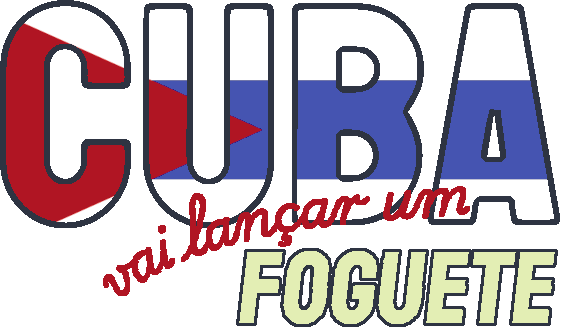
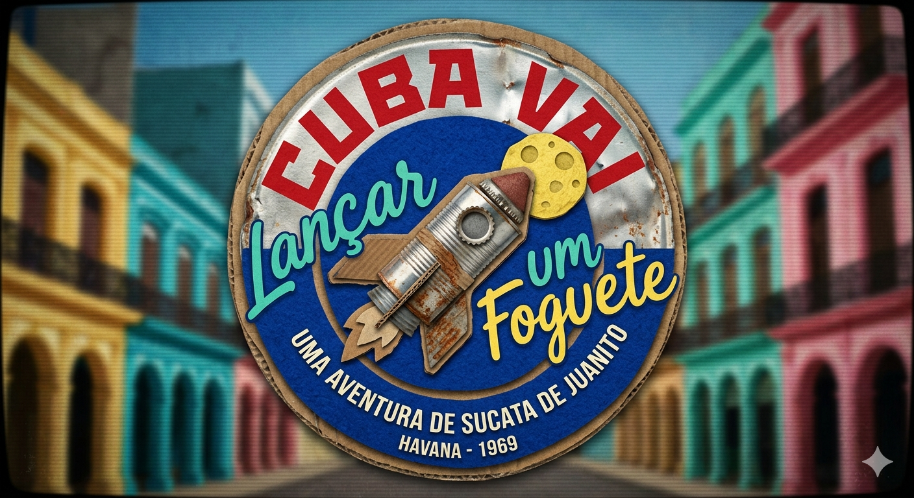
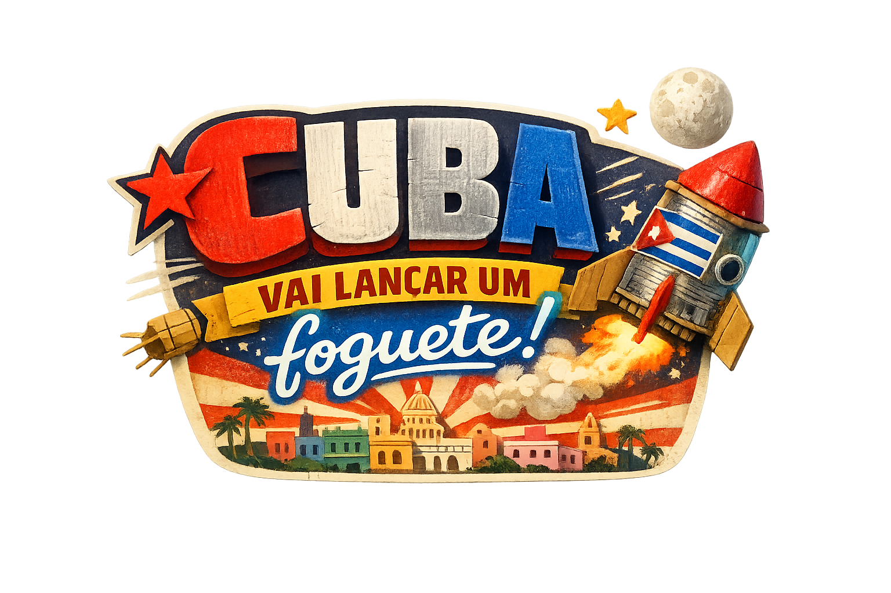
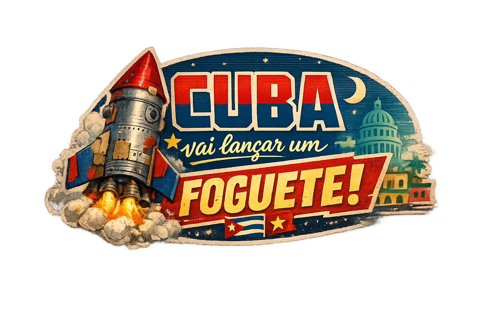

# Qual experiência, atmosfera ou sensação o jogo busca transmitir?

A atmosfera central nasce do olhar ingênuo de uma criança sobre a política internacional. O jogo deve contrastar a
tensão entre EUA e Cuba com o problema mais palpável e urgente do protagonista: não fazer xixi na cama. O paralelo entre
ter auto-controle para evitar um acidente pessoal quotidiano e o auto-controle dos líderes políticos na iminência de um
possível holocausto nuclear, com a crise dos mísseis.

Visualmente, a estética deve refletir essa inocência com o foguete feito de sucata e papelão. Também devemos evocar a
tecnologia da época com imagem de TV de cubo e um filtro CRT.

No aspecto de sensação (game feel), o gameplay começa tranquilo e flutuante, com poucos asteroides. Conforme o jogador
avança e sofre colisões, a dificuldade aumenta. Quanto mais bexiga de Juanito devemos evocar essa tensão com tremores na
tela e aceleração da música.

# Proposta sonora

- Música: space synthwave com salsa (em momentos tranquilos) e rumba (quando estiver mais tenso)
- SFX: cartunesco lembrando desenhos animados antigos

## Trilha Sonora (Music)

A música deve misturar as texturas eletrônicas do `Space Synthwave` (sintetizadores analógicos, arpejos espaciais) com a
percussão viva de Cuba.

- Menu: Uma base de Salsa fluida e alegre, transmitindo.
- Início do Jogo: Salsa continua e elementos de Synthwave são adicionados, objetivo é evocar liberdade, o deslumbre e a
  tranquilidade de flutuar pelo espaço sideral.
- Início dos Metetoros / Vontade de fazer xixi: A música faz uma transição dinâmica para a Rumba. Os sintetizadores
  tornam-se mais urgentes e estridência eletrônica se mistura à percussão frenética das congas e claves, simulando a
  aflição física e o desespero do protagonista.

## Efeitos Sonoros (SFX)

Os efeitos sonoros devem quebrar qualquer realismo espacial ou dramático, adotando uma estética cartunesca e nostálgica,
inspirada em animações clássicas. Os sons devem enfatizar a materialidade do foguete de sucata e a comédia da situação.

- Colisões: Sons de impacto estilizados (latas batendo, molas, "boings") reforçando que a nave é feita de sucata.
- Feedback de Urgência: Conforme a bexiga enxe, apitos emergência da nave e sons de líquidos (cachoeira, torneira).
- Powerups: Sons cômicos e de fácil identificação (uma descarga exagerada para a Privada Espacial e o som de pavio
  queimando para os Fogos de Artifício).

# Linguagem visual

O visual deve ser Lúdico e Texturizado (Material). Um mundo espacial construído a partir de feltro, papelão, lata e
objetos de sucata. Referências a havana e a identidade nacional de cuba.

# Cores

A paleta deve ser vibrante:

- cores dos elementos de sucata: marrom do papelão, prateado da lata
- cores da bandeira cubana: vermelho, branco e azul
- as cores da Havana real: turquesa, amarelo envelhecido, rosa

# Tipografia

## LOGO

`Staatliches`: Fonte imponente, com proporções que remetem ao construtivismo e a pôsteres de propaganda política da
metade do século XX. Representa a revolução socialista, a Guerra Fria, os discursos do Fidel e o peso das tensões
internacionais.

`Playwrite Cuba`: Simula caligrafia escolar e os neons comuns na noite de Havana, resquícios do tempo da ditadura de
Fulgencio Batista quando o país era apenas um cassino / bordel.

## UI

`Space Grotesk`: Fonte sem serifa para menus do jogo (UI) e HUD (como a pontuação e a Barra de Xixi). Ela tem um ar
retro-futurista que remete à Corrida Espacial dos anos 60 (Apollo 11) sem sacrificar a legibilidade. É moderna, mas com
aquele toque de "computador da NASA em 1969".

# Marca

Rascunho do logo feito a mão:

Como não tenho habilidades artísticas nem de design também pedi sugestões para a IA baseadas em um briefing:

# Concept Art

[Concept Art](../art/concept.jpg)

# Materiais, Texturas e Iluminação

[Cardboard](../art/textures/cardboard_circle.png)

[Old newspaper](../art/textures/old_newspaper_circle.png)

[Tin can](../art/textures/tincan.avif)

# Interface

[Menu](./wireframes/menu.svg)

[Gameplay](./wireframes/gameplay.svg)

# Efeitos Visuais

// TODO: Exemplos de partículas, iluminação, explosões, magia, glitches etc.
